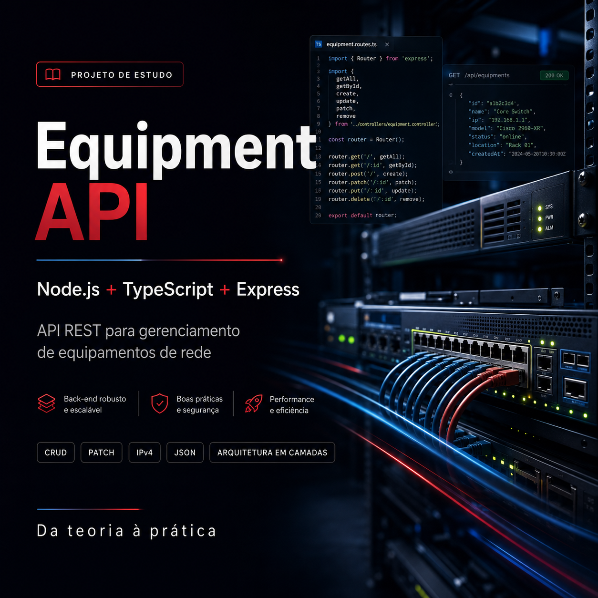
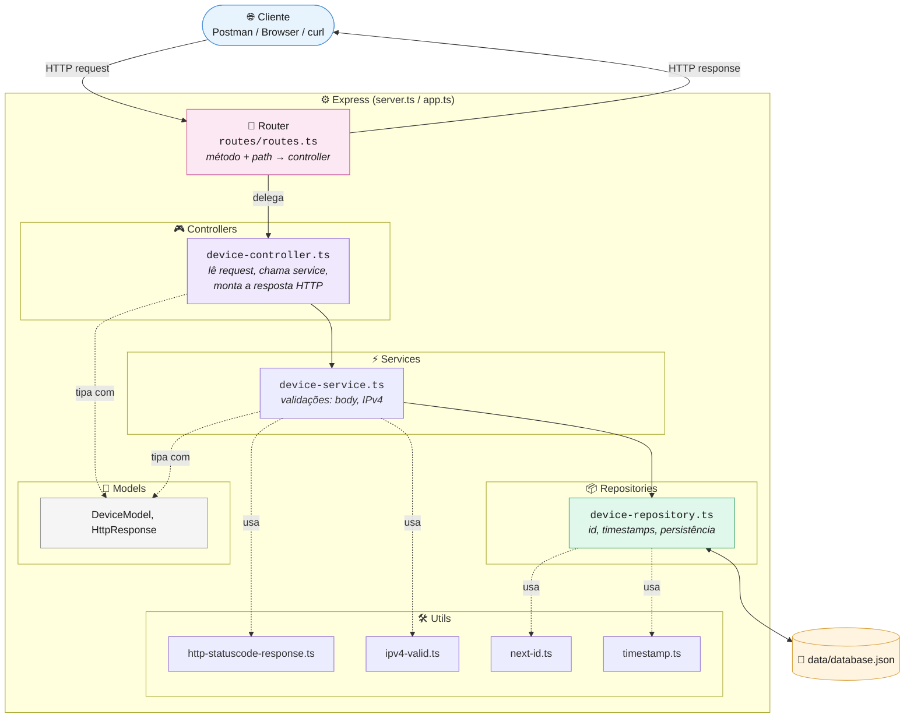

# 🌐 Equipment API



API REST para gerenciar equipamentos de rede (roteadores, switches e afins), construída com **Node.js**, **Express** e **TypeScript**.

Em resumo: é uma API CRUD onde você cadastra, consulta, atualiza e remove equipamentos de rede (nome, fabricante, modelo, IP, tipo de conexão, credenciais de acesso) através de requisições HTTP.

Este projeto foi desenvolvido para aplicar na prática os conhecimentos adquiridos no curso de Node.js + TypeScript da [**DIO.me**](https://www.dio.me/), colocando em uso conceitos como rotas, camadas de arquitetura, tipagem, persistência em arquivo e validação de entrada.

## 🚀 Tecnologias

- [Node.js](https://nodejs.org/)
- [TypeScript](https://www.typescriptlang.org/) em modo `strict`
- [Express](https://expressjs.com/) como framework HTTP
- [cors](https://github.com/expressjs/cors) para liberar CORS
- Persistência em arquivo `.json`, sem banco de dados externo
- [tsx](https://github.com/privatenumber/tsx) para execução direta de TypeScript em desenvolvimento
- [tsup](https://tsup.egoist.dev/) para build de produção (ESM)

## 🏗️ Arquitetura

A API é organizada em camadas, cada uma com uma única responsabilidade:



**Responsabilidade de cada camada:**

| Camada | Responsabilidade |
| - | - |
| **Router** | Interpreta `método HTTP` + `path` da URL e delega para o controller correspondente. Não conhece regra de negócio. |
| **Controller** | Lê a requisição (`params`, `body`), valida o formato do `id` da URL, chama o service certo e monta a resposta HTTP (status code + JSON). Não sabe onde os dados são persistidos. |
| **Service** | Contém a regra de negócio: validação de body e de IPv4, decide entre `ok`/`created`/`badRequest`/`notFound`. Não sabe nada sobre HTTP nem sobre o arquivo em disco. |
| **Repository** | Única camada que lê e escreve `data/database.json`. Gera `id` incremental e os timestamps `createdAt`/`updatedAt`. Não sabe nada sobre regra de negócio. |
| **Utils** | Funções puras e reaproveitáveis: geração de status HTTP padronizado, validação de IPv4, cálculo do próximo id e timestamp atual. |
| **Models** | Define os contratos de tipo (`DeviceModel`, `HttpResponse`) usados por todas as camadas acima. |

## 📦 Instalação

```bash
# Clone o repositório
git clone https://github.com/Renylson/equipment-api-express-nodejs-ts.git

# Acesse a pasta do projeto
cd equipment-api-express-nodejs-ts

# Instale as dependências
npm install

# Copie o arquivo de variáveis de ambiente
cp .env.example .env
```

## ▶️ Como rodar

```bash
# Modo desenvolvimento (com reinício automático)
npm run dev

# Build de produção
npm run build

# Executar build de produção
npm start
```

O servidor sobe em `http://localhost:3000` por padrão (configurável via `.env`, veja `.env.example`).

## 📖 Modelo de dados

```ts
interface DeviceModel {
  id: number;
  name: string;
  manufacturer: string;
  model: string;
  ip: string;
  connectionType: "ssh" | "telnet" | "web";
  port: number;
  login: string;
  password: string;
  createdAt: string;
  updatedAt: string;
}
```

`id`, `createdAt` e `updatedAt` são gerados automaticamente pela API — não precisam (e não devem) ser enviados no corpo da requisição.

## 🔌 Endpoints

Todas as rotas têm o prefixo `/api`.

### Listar equipamentos

```text
GET /api/devices
```

**Resposta `200 OK`** com a lista de equipamentos, ou **`204 No Content`** se não houver nenhum cadastrado.

```json
[
  {
    "name": "NE40",
    "manufacturer": "Huawei",
    "model": "NE40E",
    "ip": "10.0.0.1",
    "connectionType": "ssh",
    "port": 22,
    "login": "admin",
    "password": "admin123",
    "id": 1,
    "createdAt": "2026-08-22T00:30:02.565Z",
    "updatedAt": "2026-08-22T00:30:02.565Z"
  }
]
```

---

### Buscar equipamento por id

```text
GET /api/devices/:id
```

**Resposta `200 OK`** com o equipamento encontrado. **`400 Bad Request`** se `:id` não for numérico. **`404 Not Found`** se o `id` não existir.

---

### Cadastrar equipamento

```text
POST /api/devices
```

**Body:**

```json
{
  "name": "NE40",
  "manufacturer": "Huawei",
  "model": "NE40E",
  "ip": "10.0.0.1",
  "connectionType": "ssh",
  "port": 22,
  "login": "admin",
  "password": "admin123"
}
```

**Resposta `201 Created`:**

```json
{
  "message": "successful",
  "data": {
    "name": "NE40",
    "manufacturer": "Huawei",
    "model": "NE40E",
    "ip": "10.0.0.1",
    "connectionType": "ssh",
    "port": 22,
    "login": "admin",
    "password": "admin123",
    "id": 1,
    "createdAt": "2026-08-22T00:30:02.565Z",
    "updatedAt": "2026-08-22T00:30:02.565Z"
  }
}
```

**`400 Bad Request`** se o body vier vazio ou o `ip` não for um IPv4 válido.

---

### Atualizar equipamento (parcial)

```text
PATCH /api/devices/:id
```

**Body (campos opcionais, só envie o que quer atualizar):**

```json
{
  "name": "NE40 Renomeado"
}
```

**Resposta `200 OK`** com o equipamento completo já atualizado — campos não enviados são preservados. `id` e `createdAt` nunca são alterados, mesmo que enviados no body. `updatedAt` é sempre renovado.

**`400 Bad Request`** se `:id` não for numérico, o body vier vazio, ou o `ip` (quando enviado) não for um IPv4 válido. **`404 Not Found`** se o `id` não existir.

---

### Remover equipamento

```text
DELETE /api/devices/:id
```

**Resposta `200 OK`** com `true` em caso de sucesso. **`400 Bad Request`** se `:id` não for numérico. **`404 Not Found`** se o `id` não existir.

## ⚠️ Tratamento de erros

| Status | Quando acontece |
| - | - |
| 400 | `id` da URL não é numérico, body vazio, ou `ip` inválido (fora do padrão IPv4) |
| 404 | Equipamento com o `id` informado não encontrado |

## 📂 Estrutura do projeto

```text
equipment-api-express-nodejs-ts/
├── src/
│   ├── app.ts
│   ├── server.ts
│   ├── routes/
│   │   └── routes.ts
│   ├── controllers/
│   │   └── device-controller.ts
│   ├── services/
│   │   └── device-service.ts
│   ├── repositories/
│   │   └── device-repository.ts
│   ├── models/
│   │   ├── device-model.ts
│   │   └── http-response-model.ts
│   ├── utils/
│   │   ├── http-statuscode-response.ts
│   │   ├── ipv4-valid.ts
│   │   ├── next-id.ts
│   │   └── timestamp.ts
│   └── data/
│       └── database.json
├── .env.example
├── tsconfig.json
├── tsup.config.ts
├── package.json
└── README.md
```

## 🙏 Agradecimentos

Este projeto foi construído aplicando os conhecimentos adquiridos através do curso da [**DIO.me**](https://www.dio.me/), ministrado por [**Felipe Silva Aguiar**](https://github.com/felipeAguiarCode).

## 📄 Licença

Este projeto está sob a licença MIT.
